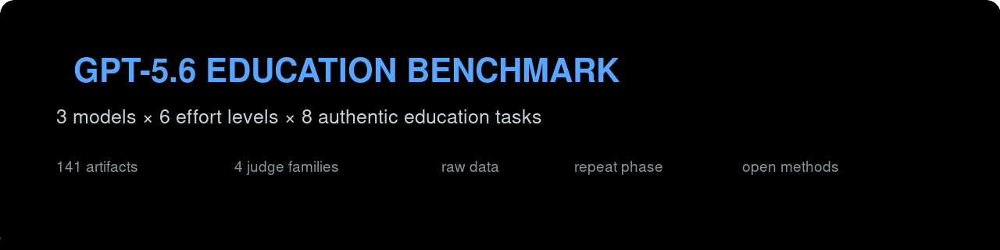

<p align="center"></p>

# GPT-5.6 Education Benchmark

A public, reproducible eight-task education benchmark of **GPT-5.6 Sol, Terra and Luna across six reasoning-effort levels**. It includes frozen tasks and hidden keys, 141 successful first-pass artifacts from a 144-seat matrix, 24 repeat artifacts, raw judge outputs, anonymisation maps, latency/token/cost metadata and the complete report.

## Headline

- **Raw full-matrix leader:** Luna/xhigh.
- **Most robust operational route:** Sol/high — the only route to lead the original screen, the same artifacts re-ranked in the full panel, and the fresh repeat.
- **Fast economy candidates:** Luna/none and Luna/low, but ranking stability was insufficient for an automatic production switch.
- **Max effort failed operationally:** Sol/max, Terra/max and Luna/max all failed to return the creative T8 artifact after repeated ~15-minute streams.
- **Important warning:** the same six artifacts changed order when judged beside twelve additional candidates. Large batched rankings show a material candidate-set/context effect.

## Full first-pass top six

| Rank | Condition | Pairwise quality | Mean judge score | Median latency | Success |
|---:|---|---:|---:|---:|---:|
| 1 | Luna/xhigh | 78.7 | 94.24 | 269s | 8/8 |
| 2 | Sol/xhigh | 69.1 | 92.53 | 220s | 8/8 |
| 3 | Sol/high | 62.9 | 91.98 | 143s | 8/8 |
| 4 | Luna/max | 61.4 | 91.99 | 422s | 7/8 |
| 5 | Luna/none | 59.6 | 86.25 | 30s | 8/8 |
| 6 | Luna/low | 57.4 | 90.17 | 38s | 8/8 |

`Pairwise quality` is a normalised task-level Copeland share, not a cardinal percentage score. See `FINAL-REPORT.md`.

## Recommended model use

| Work | Recommendation |
|---|---|
| High-consequence planning, assessment, science synthesis, final review | **Sol/high** |
| Routine production | **Sol/low, provisionally**; validate on real jobs before locking defaults |
| Economy experiment | **Luna/none or Luna/low** with deterministic checks and teacher review |
| Ceiling experiment | **Luna/xhigh**, but repeat directly against Sol/high first |
| Challenger | Terra/xhigh only where task-specific evidence justifies it |
| Exact consistency/compliance | Deterministic code, not more model reasoning |
| Max effort | Do not use operationally |

## Dataset map

- `tasks/` — frozen candidate prompts, hidden keys, rubrics and deterministic checks.
- `outputs/first-pass/` — readable first-pass artifacts by task/model/effort.
- `outputs/phase-b/` — fresh repeat artifacts for the three finalists.
- `data/full-*.json` — canonical generation, blind-pack, identity and judge records.
- `raw/` — incremental per-call records retained for auditability.
- `FINAL-REPORT.md` and `FINAL-SUMMARY.csv` — human and machine-readable conclusions.
- `scripts/recompute_report.py` — regenerates the report from public JSON.
- `scripts/verify_dataset.py` — validates counts and scans for sensitive patterns.

## Reproduce

```bash
python3 scripts/verify_dataset.py
python3 scripts/recompute_report.py
```

## Methodological limitations

- One first-pass sample per condition; only three original finalists were repeated.
- Model judges are proxies, not teacher repair-time measurements.
- Large joint judging prompts caused candidate-set/context effects.
- T1 and T4 GLM ranks were derived from independent artifact scores after its all-18 prompt failed.
- Public-equivalent prices are comparative; OAuth routes reported no actual charge.
- Three T8/max cells are censored operational failures, not fabricated artifacts.

## Privacy and provenance

This export excludes credentials, tokens, private endpoints, environment files, response IDs, local absolute paths and personal email addresses. The export script performs an additional sensitive-pattern scan before publication.

## Licences

Code is MIT licensed. Benchmark fixtures and generated data are released under CC BY 4.0; see `DATA-LICENSE.md`.
